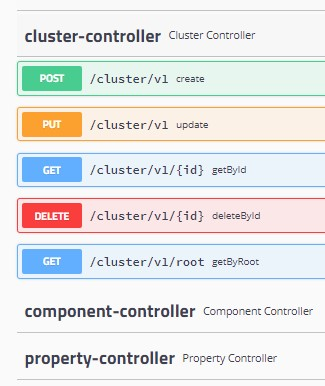
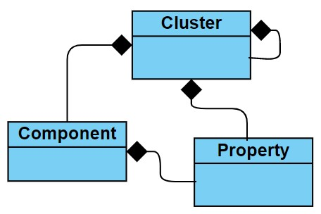
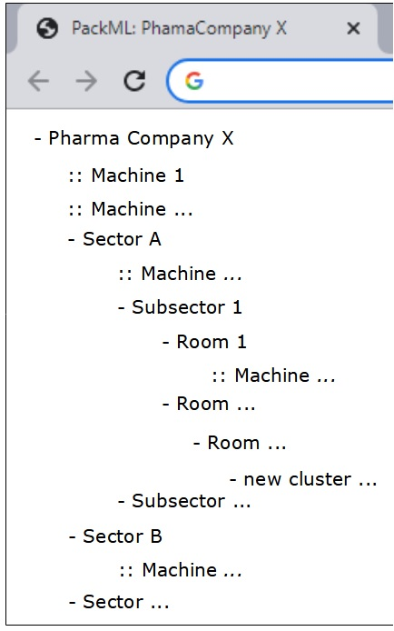

# Mapping the industry structure
This REST API has been built to map all physical environment (*cluster*), its elements (*components*) and *properties* from an Industry or Company.

* Cluster: a room, a section, a slot, a region. 
* Components: a machine, a product, a person, any element that is alocated in a cluster.
* Properties: any property related to a cluster or component.
---
## To run the project:
* Install [docker](https://www.docker.com):
* Configure the database ([postgresql in docker](https://hub.docker.com/_/postgres))
```
$ docker pull postgres:alpine
$ docker run --name your-db-name -e POSTGRES_PASSWORD=your_password -d -p 5432:5432 postgres:alpine
$ docker exec it your-db-name bash
$ psql -U postgres
$ create database packml_db;
```
* Configure the messaging broker ([RabbitMQ in docker](https://hub.docker.com/_/rabbitmq))
```
$ docker pull rabbitmq:3.9-management-alpine
$ docker run -d --hostname your-host-name --name your-broker-name -e RABBITMQ_DEFAULT_USER=your-user -e RABBITMQ_DEFAULT_PASSWORD=your-password -p 5672:5672 -p 15672:15672 rabbitmq:3.9-management-alpine 
```

To access all endpoints ([Swagger-UI](https://swagger.io)):
```
http://localhost:8081/swagger-ui.html
```

---
## Relation among data:

- A *cluster* contains (0..n) *clusters*, (0..n) *components* and (0..n) *properties*.
- A *component* contains (0..n) *properties*.



## Frontend expectation:

- Just an example for frontend developers

